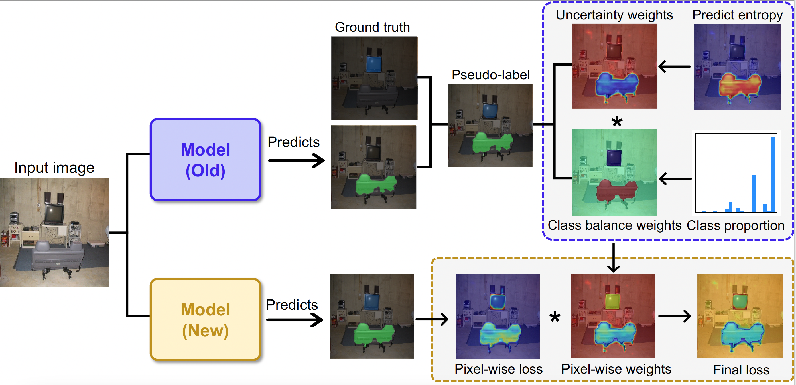

Continual Semantic Segmentation (CSS) primarily aims to alleviate catastrophic forgetting. During the incremental stage, it is necessary to utilize the old model to generate pseudo-labels, as old classes are treated as background in the incremental stage. The quality of these pseudo-labels significantly influences the model's forgetting of the old categories. In this paper, we specifically address two previously overlooked problems: the impact of erroneous pseudo-labels on model forgetting and the confusion induced by class imbalance. We propose an \textbf{U}ncertainty and \textbf{C}lass \textbf{B}alance Re-weighting approach (\textbf{UCB}) that assigns higher weights to pixels with pseudo-labels exhibiting lower uncertainty and to categories with smaller proportions during the training process. Our proposed method is straightforward and can be applied to any method that uses pseudo-labels. Extensive experiments on the Pascal-VOC and ADE20K datasets illustrate the efficacy of our proposed approach in enhancing model performance.

Abstract
======
Continual Semantic Segmentation (CSS) primarily aims to alleviate catastrophic forgetting. During the incremental stage, it is necessary to utilize the old model to generate pseudo-labels, as old classes are treated as background in the incremental stage. The quality of these pseudo-labels significantly influences the model's forgetting of the old categories. In this paper, we specifically address two previously overlooked problems: the impact of erroneous pseudo-labels on model forgetting and the confusion induced by class imbalance. We propose an \textbf{U}ncertainty and \textbf{C}lass \textbf{B}alance Re-weighting approach (\textbf{UCB}) that assigns higher weights to pixels with pseudo-labels exhibiting lower uncertainty and to categories with smaller proportions during the training process. Our proposed method is straightforward and can be applied to any method that uses pseudo-labels. Extensive experiments on the Pascal-VOC and ADE20K datasets illustrate the efficacy of our proposed approach in enhancing model performance.

UCB Method
======

