[PDF](jackchen.cloud), [CODE](jackchen.cloud)

# Domain Generation 总结

- Domain Generation：域泛化
- Source data：多个不同的训练集， Target data：目标数据集

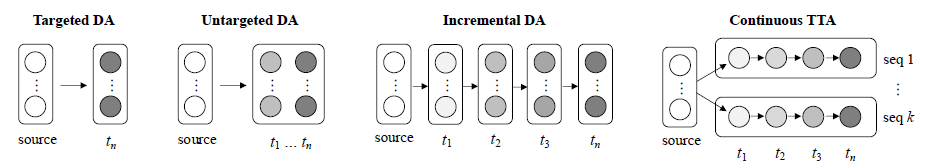

# 数据集论文：**SHIFT: A Synthetic Driving Dataset for Continuous Multi-Task Domain Adaptation**

- Continual domain adaptation

  - Source data：daytime night
    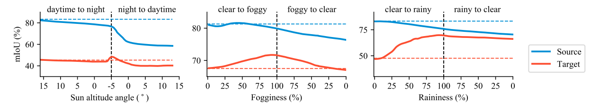
- Test-time adaptation

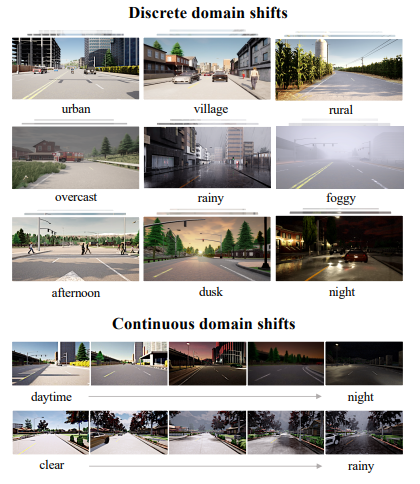

# [Challenge B](https://wvcl.vis.xyz/challenges#challengeB) - Continual Test-time Adaptation

- Goal：Adapt the model in the sequence of domain shifts continuously
- Task：Semantic segmentation | Object detection
- Data：源域图像 + 标签，目标域图像 + 标签，用于评估和测试的视频
- submit：[https://evalai.vis.xyz/](https://evalai.vis.xyz/)

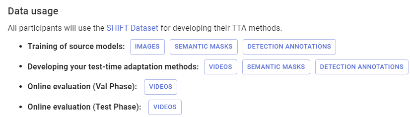

- 可使用提供的预训练模型，完成后续的 TTA 任务。
- 参考代码：

  - **物体检测**：[githu](https://github.com/SysCV/shift-detection-tta/tree/main)[b.com/SysCV/shift-detection-tta](https://github.com/SysCV/shift-detection-tta/tree/main)
  - **语义分割**：[github.com/zwbx/SHIFT-Continual_Test_Time_Adaptation](https://github.com/zwbx/SHIFT-Continual_Test_Time_Adaptation)

# Contrastive Test-Time Adaptation, CVPR2022, [PDF](https://openaccess.thecvf.com/content/CVPR2022/html/Chen_Contrastive_Test-Time_Adaptation_CVPR_2022_paper.html), [CODE](https://github.com/DianCh/AdaContrast)

## 4.1 主要工作

- 任务：图像分类
- 伪标签：聚类进行细化
- 对比学习

## 4.2 方法

- 在线伪标签优化

  - minibatch 利用图像的弱 augmentation 来找到最近邻的类（M），作为伪标签
- 联合自监督对比学习

# Continual Test-Time Domain Adaptation, CVPR2022, [PDF](https://openaccess.thecvf.com/content/CVPR2022/html/Wang_Continual_Test-Time_Domain_Adaptation_CVPR_2022_paper.html), [CODE](https://qin.ee/cotta)

## 5.1 主要工作

- 提升伪标签的生成质量：加权平均（weight-averaged teacher model）和增广平均（augmentation-averaged predictions）预测
- 解决灾难性遗忘：随机存储一小部分在源域上的预训练参数

## 5.2 TTA 任务的解释

- 源域数据不可见——隐私问题，推理时可见无标签的测试样本。
- 传统的方法：生成伪标签、熵正则化
- Online：只能访问当前数据流

## 5.3 方法

- Weight-Averaged Pseudo-Labels

  - Teacher Model：保留源模型信息，采用 ema 移动平均更新。
    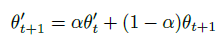
  - Student Model（main）：对目标域数据预测与 Teacher Model 保持一致，采用 CE Loss 梯度更新。
    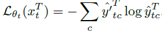
- Augmentation-Averaged Pseudo-Labels

  - 预测概率取几个 aug 上的平均值

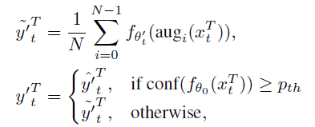

- Stochastic Restoration：保留初始模型参数
  - 随机更新某些参数
    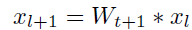
  - 参数更新方式

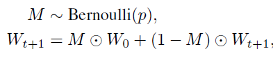

# EcoTTA: Memory-Efficient Continual Test-time Adaptationvia Self-distilled Regularization, [PDF](https://openaccess.thecvf.com/content/CVPR2023/html/Song_EcoTTA_Memory-Efficient_Continual_Test-Time_Adaptation_via_Self-Distilled_Regularization_CVPR_2023_paper.html), CODE

## 6.1 主要工作

- lightweight meta networks
- self-distilled regularization

## 6.2 方法

- Memory-efficient Architecture

  - 使用源域数据训练 lightweight meta networks
    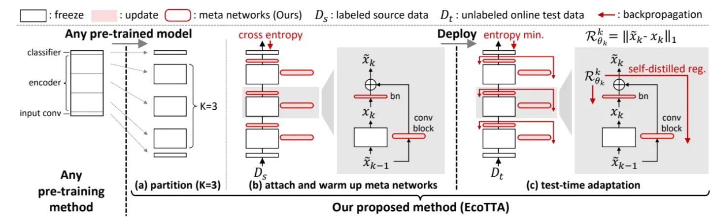
  - Entropy minimization
    - 熵最小化，参考 tent
      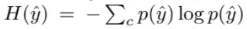

  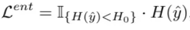
- Self-distilled Regularization

  - $x_k$:K 个 meta network frozen 的输出
  - $\hat{x_k}$:K 个 meta network 现在的输出

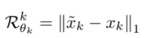

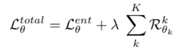

# Mean teachers are better role models: Weight-averaged consistency targets improve semi-supervised deep learning results, NIPS2017, [PDF](https://proceedings.neurips.cc/paper_files/paper/2017/file/68053af2923e00204c3ca7c6a3150cf7-Paper.pdf)

# Tent: Fully Test-Time Adaptation by Entropy Minimization, ICLR2021, [PDF](https://arxiv.org/pdf/2006.10726.pdf)

- 最小化模型预测熵（test entropy）：
  - 没有通过单个优化，而是通过 batch 优化

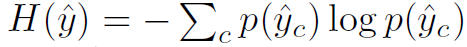

- 调制模型参数
  - 根据 batch data 来更新均值方差
  - 只更新线性层
  - 参数：$\gamma,\beta$

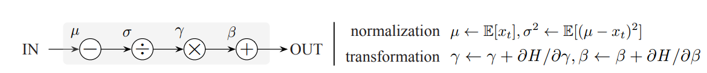

# 8.1 TIPI: Test Time Adaptation with Transformation Invariance

- 解决 Tent 需要大 batch 的问题
- 模型的表现受到：与源域数据分布之间的 KL 散度
- 虽然分布不同，但是认为他们能够提供的类别信息相同

# Parameter-Free Online Test-Time Adaptation, CVPR2022, [PDF](https://openaccess.thecvf.com/content/CVPR2022/html/Boudiaf_Parameter-Free_Online_Test-Time_Adaptation_CVPR_2022_paper.html)

- Test time Adaptation

  - Data Shift
    - Low level：雨、雾、天气
    - High level：不同风格的建筑群
  - Model expect
    - 利用无监督的测试数据，对源数据不可见
    - 在线学习，并适应 non-i.i.d（non-independent and identically distributed）（例如数据与时间相关）的数据
    - 是一种学习方式，对各个模型都有作用
- 目前的方法

  - 针对特定场景，调整超参数
- 极大似然法，$\hat{z_i}$是样本在真实分布下的预测概率[1*K]，$p_i$是源分布上的预测概率，根据测试数据来估计真实分布：
  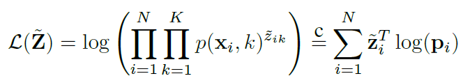
  极大似然的优化目标：$argmax(\mathcal{L}(\hat(Z)))$

  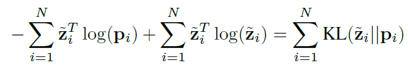
  优化目标：$argmin(\sum\limits_{i = 1}^N {KL({{\tilde z}_i}||{p_i})})$
  $w_{ij}$衡量样本$i$和$j$特征的相似度，即特征相似的两个样本预测结果相似。

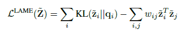

- 通过凹凸过程实现高效优化
  - 利用 KKT 条件

# Feature Alignment and Uniformity for Test Time Adaptation, CVPR2023, [PDF](https://openaccess.thecvf.com/content/CVPR2023/html/Wang_Feature_Alignment_and_Uniformity_for_Test_Time_Adaptation_CVPR_2023_paper.html)

# Robust Test-Time Adaptation in Dynamic Scenarios, CVPR2023, [PDF](https://openaccess.thecvf.com/content/CVPR2023/html/Yuan_Robust_Test-Time_Adaptation_in_Dynamic_Scenarios_CVPR_2023_paper.html)

## 11.1 主要贡献

- 提出了 PTTA（practical TTA）测试数据的分布随时间变化
- RBN（robust batch normlization）旨在通过维护一组全局统计量来稳健地对特征图进行规范化，从而解决测试时域偏移导致不准确规范化的问题。
- CSTU 通过维护一个带有类别平衡采样的记忆库，以考虑样本的及时性和不确定性，来捕捉当前测试分布的稳定快照。记忆库使用测试样本的预测结果作为伪标签进行更新。
- 具有时效性的鲁棒训练重点是通过使用时效性重新加权策略来减少旧的和不可靠实例的错误梯度风险。该策略根据记忆库中实例的预测结果和年龄来更新学生模型和教师模型。

# ~~TempT: Temporal Consistency for Test-Time Adaptation, CVPR2023, ~~~~PDF~~

# NOTE: Robust Continual Test-time Adaptation Against Temporal Correlation, NIPS2022, [PDF](https://arxiv.org/abs/2208.05117), [CODE](https://github.com/TaesikGong/NOTE)

- 每一个批量的分布对模型有影响，batch normalization，对于 continuous batchsize 为 1，因此影响更大。

  - 一般的做法：利用训练阶段 batch normalization 的$\mu,\sigma$
  - 利用样本的均值、协方差估计，调整 batch normalization 的参数
    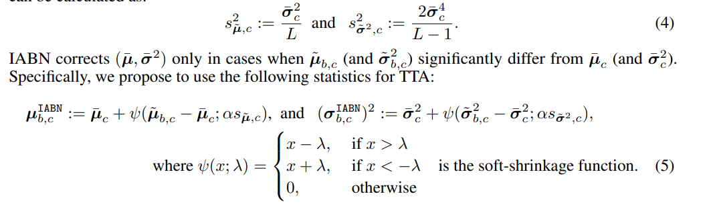
- 写的很不错，表达简单清楚。
-

# Confidence Score for Source-Free Unsupervised Domain Adaptation, [PDF](https://proceedings.mlr.press/v162/lee22c/lee22c.pdf), [CODE](https://github.com/Jhyun17/CoWA-JMDS), ICML2022

## 摘要

- 区分不同样本的重要性：differentiate between sample importtance -》 sample wise score
- 与以往方法不同点：both source and target domain knowledge

摘要写作

# 实验思路

# 20230723

- augmentation：光线、对比度、饱和度、色调的变化

  - 带来的问题：不同的数据集 augmentation 的方式不同
- 学习的策略：现有方法依赖于 teacher 模型的指导（teacher 对场景变化不敏感的物体学习较好），但是无法使 student 学习到新场景下的变化大的事物。

  - teacher 置信度高的：选择置信度最大的作为伪标签
  - 剩余部分：利用 augmentation，使得预测结果一致
- adaptation 的含义

  - 适应分布，而不是让模型能够同时在各种分布下都学的好。不能同时让模型在 4 个 aug 下都学好。
  - batchnorm 的调整：batchsize 为 1，并且与训练的分布不同。
- 实验结果

  - 语义分割

# **Test-time Adaptation**

1. ICML2023 <u>AdaNPC: Exploring Non-Parametric Classifier for Test-Time Adaptation</u>(用 KNN 进行测试时间自适应，从理论上分析了 TTA work 的原因)[[Code]](https://github.com/yfzhang114/AdaNPC) [[Reading Notes]](https://zhuanlan.zhihu.com/p/624770864)
2. NeurIPS 2021 [Spotlight] [Test-Time Classifier Adjustment Module for Model-Agnostic Domain Generalization](https://zhuanlan.zhihu.com/p/559916666)(在 test 的阶段，我们在依然会选择更新模型头部的 linear 层)
3. CVPR 2021 [Adaptive Methods for Real-World Domain Generalization](https://zhuanlan.zhihu.com/p/559916666)(测试时输入 source domain embedding，即 test 时利用 domain 信息)
4. ICLR 2021 [Spotlight] [Tent: Fully Test-Time Adaptation by Entropy Minimization](https://zhuanlan.zhihu.com/p/559916666)(测试时最小化模型预测的 entropy)
5. ICCV 2021 [Test-Agnostic Long-Tailed Recognition y Test-Time Aggregating Diverse Experts with Self-Supervision](https://zhuanlan.zhihu.com/p/559916666)(测试时优化样本的自监督损失)
6. NeurIPS 2022 [Revisiting Realistic Test-Time Training: Sequential Inference and Adaptation by Anchored Clustering](https://arxiv.org/abs/2206.02721)(发现源和目标域中的集群，并将目标集群与源集群进行匹配，以改进泛化。)
7. NeurIPS 2022 [Test-Time Prompt Tuning for Zero-Shot Generalization in Vision-Language Models](https://arxiv.org/abs/2209.07511)(测试阶段根据最小化预测熵从而更新 prompt)
8. NeurIPS 2022 [MEMO: Test Time Robustness via Adaptation and Augmentation](https://arxiv.org/abs/2110.09506)(测试阶段数据增强 + 最小化熵)
9. NeurIPS 2022 [Test-Time Adaptation via Conjugate Pseudo-labels](https://arxiv.org/abs/2207.09640)(对于现存的有/无监督的 TTA loss，可以通过对偶的推导简单的得到最优 TTA loss（从广泛的函数类别中进行元学习以获得的最佳的 TTA 损失），这个 loss 可以转化为一类特殊的伪标签，被称为 Conjugate Pseudo-labels)
10. CVPR 2022 [Continual Test-Time Domain Adaptation](https://arxiv.org/abs/2203.13591)(从一个源域 adapt 到一系列连续改变的目标域)
11. Arxiv [A Simple Test-Time Method for Out-of-Distribution Detection](https://arxiv.org/pdf/2207.08210.pdf)(test time adaptation for OOD detection)
12. SIGKDD 2023 [Domain-Specific Risk Minimization for Out-of-Distribution Generalization](https://arxiv.org/abs/2208.08661)(每个域学习单独的分类器，测试阶段根据 entropy 动态组合)[[Code]](https://github.com/yfzhang114/AdaNPC)[[Reading Notes]](https://zhuanlan.zhihu.com/p/631524930)
13. CVPR 2023 [Improved Test-Time Adaptation for Domain Generalization](https://arxiv.org/abs/2304.04494)(使用一个具有可学习参数的损失函数，而不是预定义的函数)
14. ~~CVPR 2023 ~~~~Feature Alignment and Uniformity for Test Time Adaptation~~~~(将 TTA 作为一个由于源域和目标域之间的域差距而导致的特征修订问题:确保当前批和所有先前批之间的表示之间的均匀性,一致性)~~
15. ~~CVPR 2023 ~~~~TIPI: Test Time Adaptation with Transformation Invariance~~~~(为了克服小 batch 的问题提出了一个新的 loss)~~
16. ICLR 2023 Oral [Towards Stable Test-Time Adaptation in Dynamic Wild World](https://openreview.net/forum?id=g2YraF75Tj)(测试数据流可能具有混合域偏移、小批量和不平衡标签分布 shift)
17. ICLR 2023 [Towards Understanding GD with Hard and Conjugate Pseudo-labels for Test-Time Adaptation](https://openreview.net/forum?id=FJXf1FXN8C)(带共轭标签的 GD 收敛于在高斯模型下任意小误差的最优预测器，而带有传统伪标签的 GD 在此任务中失败。)
18. ICLR 2023 [Energy-Based Test Sample Adaptation for Domain Generalization](https://openreview.net/forum?id=3dnrKbeVatv)(将目标域数据 adapt 到源域，利用随机梯度朗之万动力学的能量最小化方法迭代更新样本)
19. ICLR 2023 [Deja Vu: Continual Model Generalization for Unseen Domains ](https://openreview.net/forum?id=L8iZdgeKmI6)(Continual Domain Shift Learning (CDSL))
20. ICLR 2023 [MECTA: Memory-Economic Continual Test-Time Model Adaptation](https://openreview.net/forum?id=N92hjSf5NNh)(目前大多数 TTA 方法内存消耗比较高因为要反向传播，本文建议减少批处理大小，采用自适应规范化层来保持稳定和准确的预测，并启发式地停止反向传播缓存。另一方面，我们对网络进行修剪以减少优化过程中的计算和内存开销，并在优化后恢复参数以避免遗忘)
21. ICML 2023 Oral [The Price of Differential Privacy under Continual Observation](https://zhuanlan.zhihu.com/p/639174050)(连续适应模型场景下的差分隐私)
22. ICML 2023 Oral [ODS: Test-Time Adaptation in the Presence of Open-World Data Shift](https://zhuanlan.zhihu.com/p/639174050)(同时适应协变量和标签分布的偏移)
